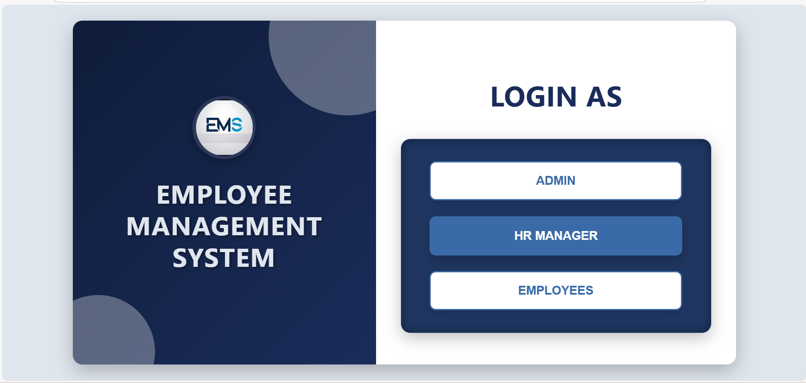
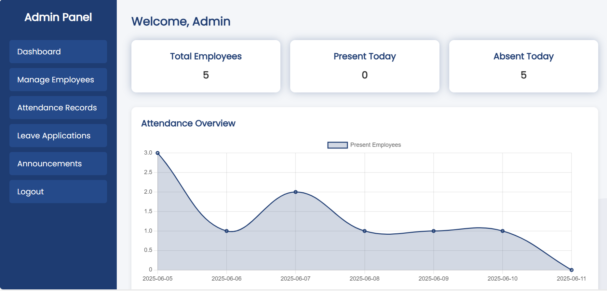
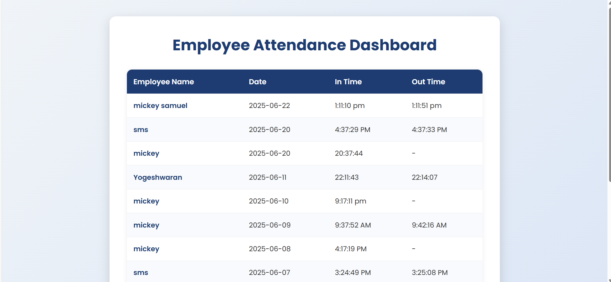
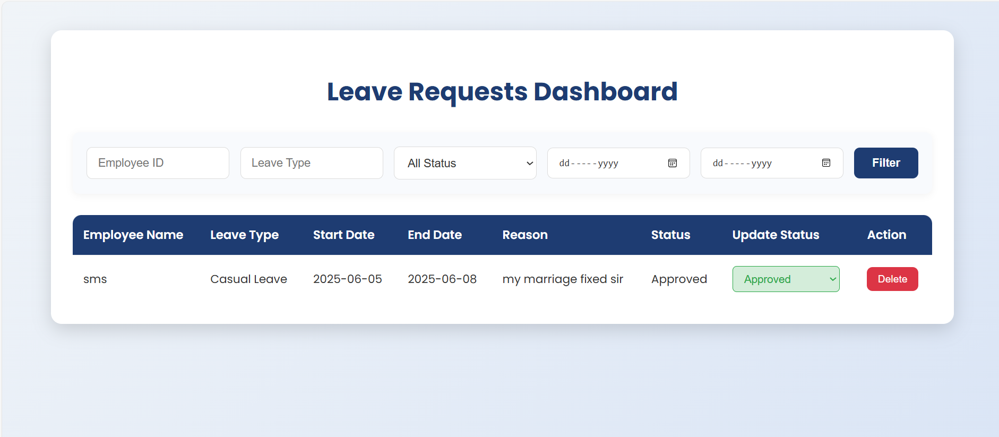
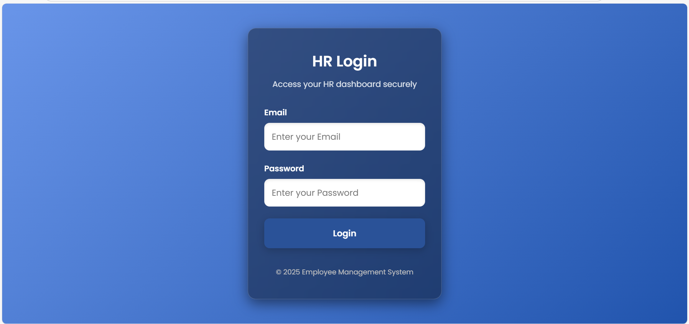
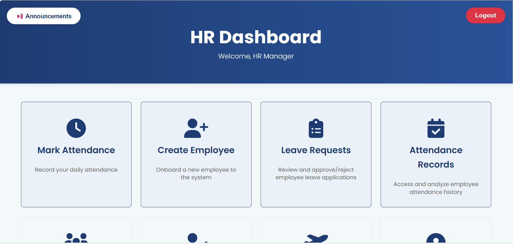
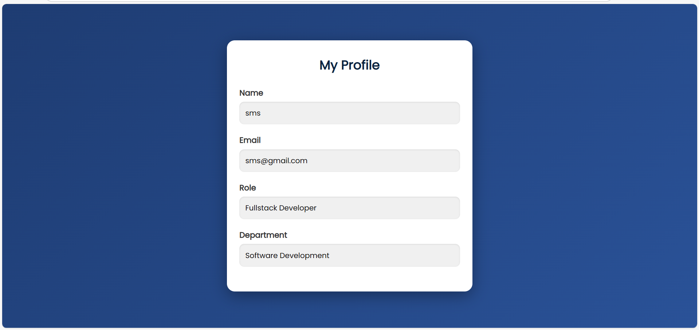

# Employee Management System 

A web-based Employee Management System (EMS) built using **HTML**, **CSS**, **JavaScript**, and **Firebase**. This system includes login authentication, role-based dashboards (Admin, HR, Employee), attendance tracking, and leave application management.

---

##  Live Project

 **Access the Project Here**: [https://ems-2-0.netlify.app/](https://ems-2-0.netlify.app/).

---

##  Test Login Credentials

You can use the following demo accounts to test different dashboards:

###  Admin
- Id: `admin
- Password: `admin1234`

###  HR
- Email: `hr2@gmail.com`
- Password: `hr2345`

###  Employee
- Email: `sms@gmail.com`
- Password: `sms123`

##  Features

-  Firebase Authentication-based Login
-  Role-Based Access: Admin, HR, and Employee
-  Attendance Marking System
-  Leave Requests and Approvals
-  Real-Time Dashboard using Firestore
-  Responsive Design with Clean UI

##  Folder Contents

> All files are in single HTML files with embedded JavaScript and CSS. Here's an example of key pages:

- `index.html` – Landing/Login Page
- `admin_dash.html` – Admin features
- `hrdashboard1.html` – hr feautures
- `emp-trail2.html` – employee features

##  Tech Stack

- **Frontend**: HTML, CSS, JavaScript
- **Backend**: Firebase Authentication + Firestore
🔐 Firebase keys have been removed. To test this app, create your own Firebase project and replace the config.
##  Screenshots

###  Main  Page

###  Admin Dashboard

###  Attendance Page

###  Leave Request Page

### HR Login page

### HR DASHBOARD Page

### Employee Profile

---

##  Team Members

- **Mohan K** – Team Lead (Frontend & Backend Developer)
- **Suriya J** – Team Member  
- **I. Mickey Samuel** – Team Member (Designer)  
- **A. Yokeshvaran** – Team Member (Tester)

               
             

